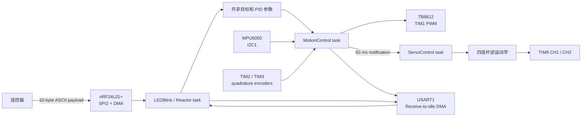
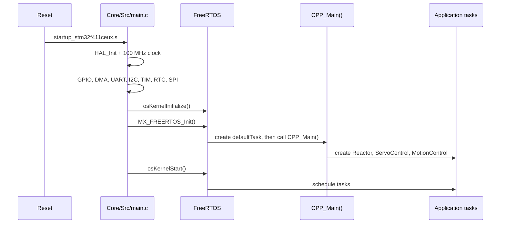

# 小车端软件架构

本文描述 `car_firmware` 当前实际运行的任务、数据流、控制环和并发约束。
硬件接线、构建与首次上电流程见项目根目录的 [README](../README.md)。

## 数据流



命令接收和控制计算通过一组 `volatile` 全局目标值连接。当前实现没有统一的
状态快照对象，因此扩展跨任务状态时必须考虑多字段更新的一致性。

## 启动流程



`CPP_Main()` 在调度器启动前创建任务。默认 CMSIS-RTOS2 任务只等待 1 s 后
删除自身，不参与控制。当前创建结果使用按位 OR 累积，因此
`CPPMain: success` 不能严格证明三个任务都创建成功。

## 任务模型

FreeRTOS tick 为 1 kHz，`xTaskCreate()` 的栈深度单位是 32-bit word。

| 任务 | 优先级 | 栈 | 周期/唤醒源 | 主要职责 |
| --- | ---: | ---: | --- | --- |
| MotionControl | 29 | 2500 words | 10 ms | IMU、编码器、串级 PID、电机 PWM |
| LEDBlink | 28 | 2000 words | UART/nRF 通知；100 ms 超时 | 命令解析、无线 IRQ、遥测、PC13 |
| ServoControl | 28 | 256 words | MotionControl 每 50 ms 通知 | 腿高目标快照、逆运动学、舵机目标 |
| defaultTask | CMSIS low | 64 words | 启动后等待 1 s | 删除自身 |

`LEDBlink` 的名称来自早期实验。它现在是 UART/nRF 事件反应器，LED 翻转只是
其中一个周期动作。

### MotionControl

实际创建的是 `MotionControlFunc_PID()`。每 10 ms：

1. 读取 MPU6050，经 VQF 得到 Roll、Pitch、Yaw；
2. 到达 50 ms 周期时更新速度、差速和左右腿目标；
3. 根据限幅后的左右腿平均高度与最低腿高标定基准计算实时偏置和姿态环 `Kp`，更新姿态 PID；
4. 组合直行和差速 PWM，限幅后写入 TB6612。

以上 PID 更新只在 `Control_armed` 为真时运行。启动门限由 `BalanceStartupGate`
维护：有效 IMU 数据、补偿后的俯仰在 ±8° 内、横滚在 ±5° 内、角速度不超过
20°/s、速度和转向目标绝对值小于 1，连续 50 个周期后使能。
IMU 读取失败或姿态无效、俯仰/横滚超过 ±30° 时立即退出控制。

等待期间清空四个 PID 的历史和积分，轮子 PWM 保持 0，左右腿都使用限幅后的
共同高度；每 50 ms 消费一次编码器增量并通知舵机，避免重新使能时使用旧轮速。
PID 首次测量及 reset 后首次测量不计算微分，后续仍沿用原微分公式。

每累计 5 次，即每 50 ms：

1. 读取左右轮 RPM；
2. 速度 PID 根据平均 RPM 生成俯仰目标；
3. 差速 PID根据左右 RPM 差生成转向 PWM；
4. 横滚增量式 PID 和几何补偿生成左右腿高度差；
5. 分别限幅左右腿目标到 `44.5..78.5 mm`，通知 `ServoControl` 更新舵机。

控制关系可概括为：

```text
angle_target = velocity_pid(velocity_target, average_rpm)
differ_pwm   = differ_pid(differ_target, left_rpm - right_rpm)
even_pwm     = angle_pid(angle_target, pitch + angle_bias)

left_pwm  = clamp(even_pwm + differ_pwm, -1000, 1000)
right_pwm = clamp(even_pwm - differ_pwm, -1000, 1000)
```

横滚误差绝对值超过 3° 时，会叠加正弦几何补偿。左右腿目标随后被限制到
`44.5..78.5 mm`。

`Angle_bias_min` 是 `anglebias` 命令设置的最低腿高基准，默认 `12.6°`。
MotionControl 每周期计算 `Angle_bias = Angle_bias_min + f(h) - f(44.5)`，
其中 `f(h) = 0.01026*h*h - 1.258*h + 48.24`，
`h = (Left_Legheight + Right_Legheight) / 2`。基准只由命令修改，复位恢复默认；
实时偏置只由控制任务计算。`Angle_kp = 0.3*h + 56.9` 使用同一个平均高度。

左右腿目标初值均为 `44.5 mm`，只由 MotionControl 生成和限幅。
该高度是舵机控制目标，不是实际腿高反馈。

### ServoControl

任务阻塞等待直接任务通知，不主动轮询。收到通知后：

1. 在短临界区内读取同一组已限幅的左右腿目标；
2. 通过 `LegKinematics::getMotorAngleForHeight()` 求舵机角；
3. 两侧都减去 10° 装配偏置；
4. 调用 `setAngle_Smooth(..., 1000)` 更新平滑目标。

`Servo` 使用 10 ms FreeRTOS 软件定时器逐步逼近目标。

### LEDBlink / Reactor

`TaskReactor` 给每个信号分配一个任务通知 bit：

- UART receive-to-idle 完成后，将最多 32 字节放入命令队列；
- nRF IRQ 到来后读取状态；收到 payload 时将其放入同一个命令队列；
- TX 成功或达到最大重试次数后，将 nRF 切回 RX；
- 命令队列容量为 4；
- 100 ms 无事件超时时翻转 PC13；启用遥测时同时发送一帧 nRF 数据。

命令名称区分大小写。解析器按空格分隔 token，不提供转义、校验和或身份认证。

## 当前默认控制参数

| 参数 | 默认值 | 说明 |
| --- | ---: | --- |
| Angle `Kp / Ki / Kd` | `70 / 0 / 60` | 姿态环；运行时 `Kp` 会随腿高重算 |
| Minimum-height angle bias | `12.6°` | `anglebias` 设置的 44.5 mm 基准，运行时保持至下次修改或复位 |
| Effective angle bias | `12.6°` | 基准叠加当前平均腿高相对 44.5 mm 的补偿，每 10 ms 更新 |
| Velocity `Kp / Ki / Kd` | `0.05 / 0.008 / 0` | 平均轮速到俯仰目标 |
| Difference `Kp / Ki / Kd` | `2 / 0.001 / 0` | 左右轮速差到差速 PWM |
| Roll `Kp / Ki` | `0 / -0.4` | 横滚到左右腿高度差 |
| Velocity target | `0` | RPM 目标 |
| Difference target | `0` | 左右 RPM 差目标 |
| Roll target | `0°` | 车体横滚目标 |
| Leg height | `44.5 mm` | 共同腿高目标 |
| Motor dead zone | `50 / 50` | TB6612 A/B PWM counts |

在线修改方式见 [命令参考](commands.md)。

## 中断与 DMA

| 中断 | NVIC 优先级 | ISR 到任务的同步 |
| --- | ---: | --- |
| SPI2 RX/TX DMA | 5 | binary semaphore |
| USART1 RX/TX DMA | 5 | RX 通知 / TX 固定缓冲队列 |
| SPI2 global | 5 | HAL SPI IRQ |
| USART1 global | 5 | HAL UART IRQ |
| nRF IRQ / EXTI15_10 | 6 | direct-to-task notification |
| TIM2 / TIM3 | 6 | HAL TIM IRQ |
| TIM5 HAL time base | 15 | HAL tick |

`configLIBRARY_MAX_SYSCALL_INTERRUPT_PRIORITY` 为 5。调用 FreeRTOS ISR API
的中断，NVIC 数值优先级不能小于 5。

MotionControl 的周期等待和 IMU I2C 读取位于临界区外，保证调度及 HAL 超时
计时正常。共享状态更新和控制输出仍在临界区中；不要在其中增加阻塞操作。

## 内存模型

- FreeRTOS heap 为 32 KiB，使用 `heap_4.c`；
- 应用任务通过 `xTaskCreate()` 动态创建，但只在启动阶段分配；
- nRF SPI 同步信号量通过 `xSemaphoreCreateBinary()` 创建；
- UART 数据缓冲、ETL 队列和命令表使用固定容量；
- UART 默认有 10 个 128 字节 TX 缓冲和 10 个 128 字节 RX 缓冲；
- UART TX 缓冲耗尽时，新日志会被静默丢弃；
- 控制周期内不应新增 `new`、`malloc` 或无界 STL 容器。

## 模块边界

| 模块 | 当前职责 |
| --- | --- |
| `MPU6050` / `vqf` | I2C 采样、量程换算、姿态融合 |
| `HallEncoder` | 定时器正交编码、累计计数、RPM 换算 |
| `TB6612` | PWM、方向和死区 |
| `Servo` | 物理角度到脉宽、软件定时器平滑 |
| `LegKinematics` | 四连杆正/逆运动学 |
| `BalanceCompensation` | 腿高限幅、左右平均高度和最低腿高基准的俯仰补偿 |
| `BalanceStartupGate` | 上电稳定等待、倾倒/IMU 异常退出和重新使能 |
| `PID` | 位置式和增量式 PID |
| `NRF24L01P` | SPI 寄存器、收发状态机、IRQ 处理 |
| `LkUart` | Receive-to-idle DMA 和异步格式化发送 |
| `TaskReactor` | 通知 bit 到回调的分发、命令 token 解析 |
| `Component/UserApp/main.cpp` | 任务装配、共享状态和当前业务流程 |

`LQR` 是保留的实验控制器；当前构建会编译它，但 `CPP_Main()` 不创建
`MotionControlFunc()`。`MainControl.*` 目前为空壳，不在运行路径中。

## 已知实现约束

以下是阅读代码或调参时必须知道的当前行为：

- `Angle_kp` 每 10 ms 根据左右腿平均高度重算，`anglepid -p` 在线写入只会短暂生效；
- `anglebias` 修改最低腿高基准，实时 `Angle_bias` 仍会随腿高变化；需保留原补偿曲线的适用条件；
- `rollpid -p` 和 `rollpid -i` 当前都写入 `Adapt_y_ki`；
- `motor` 命令会发送任务通知，但 PID 控制路径没有消费该通知；
- TB6612 零命令保持 PWM 为 0；50 counts 死区仅应用于非零命令；
- VQF 依赖 NaN 初始化标记，构建必须保留 IEEE 浮点语义，禁止 fast-math；
- nRF 遥测命令会临时把车端从 RX 切到 TX，发送完成或失败后才恢复 RX；
- 控制参数只保存在 RAM 中，复位后恢复编译时默认值。
