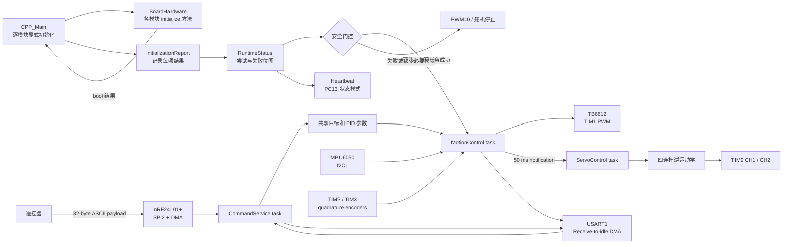
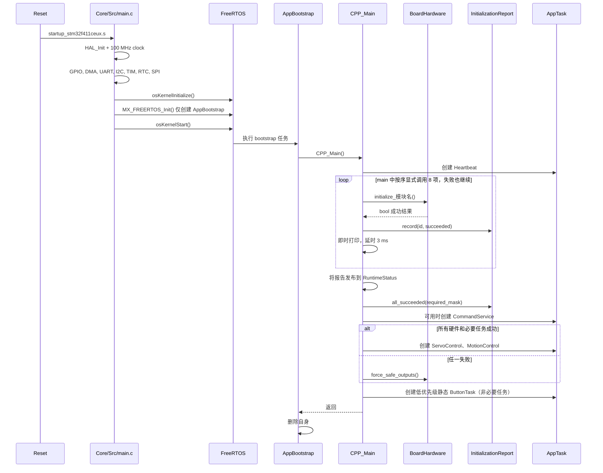
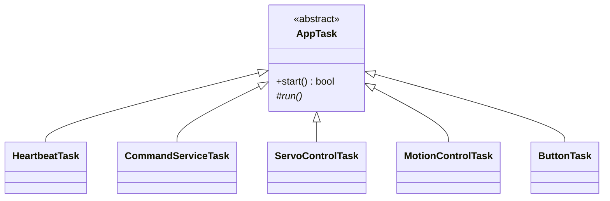

# 小车端软件架构

本文描述 `car_firmware` 当前实际运行的任务、数据流、控制环和并发约束。
硬件接线、构建与首次上电流程见项目根目录的 [README](../README.md)。

## 数据流



命令任务是 `ControlParameters` 的唯一写入者，运动任务是姿态反馈和腿目标的唯一
写入者。`ControlState` 以短临界区复制完整值，接收者不持有可写共享引用；`R`
命令的四个目标一起发布。启动状态和安全许可由 `RuntimeStatus` 管理。

PA0 → `ButtonTask` → 8 条固定事件队列 → `CommandServiceTask::handle_button_event`。
按键扫描不主动唤醒命令或控制任务。时序、内存及业务接入见 [PA0 按键](button-a0.md)。

## 启动流程



`CPP_Main()` 只在调度器运行后执行，因此舵机软件定时器、nRF DMA 信号量和会
阻塞等待 DMA 的初始化都处于合法 RTOS 上下文。`CPP_Main()` 是组合入口：构造
具有静态生命周期的设备与任务对象、注入依赖、逐个调用硬件初始化、汇总结果、
判断安全门控并启动任务。`cpp_Interface.h` 仅向 C 代码暴露
`void CPP_Main(void)`，不通过这个跨语言头文件传递 C++ 驱动或应用依赖。

### 显式初始化与故障聚合

打开 `Component/UserApp/main.cpp` 即可按执行顺序看到八个
`board.initialize_*()` 调用，不需要追踪工厂、函数指针表或观察回调。
每项初始化返回 `bool`，入口将结果交给 `InitializationReport::record(id, succeeded)`，
同时打印模块日志并保留原有 3 ms 节流。单项失败只记录结果，不短路后续调用。

`Bsp/HardwareModule.hpp` 集中声明稳定 ID、日志名称、`kHardwareModuleCount` 和
`kRequiredHardwareMask`；现有八个硬件模块均为必要模块。`InitializationReport`
是无 HAL、RTOS 和板级依赖的结果记录类型，不执行初始化或日志回调。
`all_succeeded(required_mask)` 在检查失败的同时，要求必要模块已全部尝试并成功，
且报告有效，避免漏写一项初始化时错误地放行控制。BSP 只提供硬件能力与结果，
不依赖 `Application`，由 UserApp 负责应用状态和安全策略。

| bit | 模块 | 成功条件 |
| ---: | --- | --- |
| 0 | command-uart | USART1 receive-to-idle DMA 成功启动 |
| 1 | imu-mpu6050 | I2C 事务成功且 WHO_AM_I 为 `0x68` |
| 2 | left-encoder | TIM2 encoder interface 成功启动 |
| 3 | right-encoder | TIM3 encoder interface 成功启动 |
| 4 | wheel-motor | TIM1 两个 PWM channel 均成功启动 |
| 5 | left-servo | TIM9 CH1 与对应软件定时器可用 |
| 6 | right-servo | TIM9 CH2 与对应软件定时器可用 |
| 7 | radio-nrf24 | SPI 配置完成且 RF_CH/SETUP_AW 回读匹配 |

定时器步骤只能证明 MCU 外设可用，不能检测没有识别/反馈信号的板外电机、编码器
或舵机是否真实连接。MPU6050 和 nRF 有可验证身份/寄存器，因此主控板单独上电
时通常得到失败位图 `0x82`。

安全门控要求硬件报告全成功、Heartbeat/CommandService 创建成功，并且
ServoControl 创建成功后，才临时打开 `control_enabled` 并创建 MotionControl。
必要任务失败都会调用 `BoardHardware::force_safe_outputs()`。ButtonTask 的创建失败
仅记入任务失败 bit 4，不影响控制许可。运行期间连续 3 次 IMU
读取失败会关闭控制许可、把状态锁存为 `runtime_fault` 并安全停机，启动尾部不能覆盖它。

### 参考框架的适配

参考工程 [esp_idf_template](https://github.com/lk888l/esp32_idf/tree/main/esp_idf_template)
按 `app`、`app_modules`、`base`、`logger` 分层，以 `AppManager` 管理固定 8 个槽位，
由工厂生成 `unique_ptr` 模块，注册后统一 `initialize_all()` / `process_all()`，
初始化失败时回滚已启动模块。

WL1 借鉴入口组合、模块封装和职责分层，并按机器人现有运行方式作以下适配：

- 初始化编排直接写在 `main.cpp`，模块顺序和依赖关系可直接审阅；轻量报告只负责结果。
- 模块失败后继续初始化，以保留可用串口、无线应答和独立心跳；控制输出由最终门控关闭。
- 持久任务仍封装为 `AppTask` 子类，通过构造函数注入依赖，由 FreeRTOS 按原周期、
  栈和优先级调度，不引入 `process_all()` 轮询。
- BSP、共享状态和任务对象在入口使用静态生命周期，不引入动态模块所有权、销毁或回滚。

这些取舍保留了主控制路径和故障诊断语义，同时减少启动流程中的间接调用。

## 任务模型

FreeRTOS tick 为 1 kHz，任务栈深度单位是 32-bit word。所有业务任务均继承抽象
`AppTask` 并覆盖 `run()`，各自持有构造时注入的依赖，实现在 `UserApp/Tasks/`。

| 任务 | 优先级 | 栈 | 周期/唤醒源 | 主要职责 |
| --- | ---: | ---: | --- | --- |
| MotionControl | 29 | 2500 words | 10 ms | IMU、编码器、串级 PID、电机 PWM |
| CommandService | 28 | 2000 words | UART/nRF 通知；100 ms 超时 | 命令解析、无线 IRQ、遥测、状态应答 |
| ServoControl | 28 | 256 words | MotionControl 每 50 ms 通知 | 腿高限幅、逆运动学、舵机目标 |
| AppBootstrap | CMSIS low | 512 words | 仅启动阶段 | 硬件初始化、任务装配，随后删除自身 |
| Heartbeat | 1 | 192 words | 80..920 ms，按状态变化 | 独立驱动 PC13 状态心跳 |
| ButtonA0 | 1 | 128 words，静态 | 5 ms 扫描 | 消抖、单击/双击/长按、有界事件发布 |

`AppTask` 统一封装任务名称、栈、优先级、句柄和通知。创建是显式操作，不能复制、
移动或删除运行中的任务，`run()` 不得返回。配置集中于 `Tasks/TaskConfig.hpp`，
编译期检查优先级关系和周期。原有四个任务保持启动期动态分配；ButtonTask 提供
自己的栈和 TCB，使用 `xTaskCreateStatic()`。虚函数分发只发生在任务入口。



### MotionControl

实际创建的是 `MotionControlTask`，保留原串级 PID 算法。每 10 ms：

1. 根据腿高重新计算俯仰静态偏置和姿态环 `Kp`；
2. 读取 MPU6050，经 VQF 得到 Roll、Pitch、Yaw；
3. 更新姿态 PID；
4. 组合直行和差速 PWM，限幅后写入 TB6612。

每累计 5 次，即每 50 ms：

1. 读取左右轮 RPM；
2. 速度 PID 根据平均 RPM 生成俯仰目标；
3. 差速 PID根据左右 RPM 差生成转向 PWM；
4. 横滚增量式 PID 和几何补偿生成左右腿高度差；
5. 通知 `ServoControl` 更新舵机。

控制关系可概括为：

```text
angle_target = velocity_pid(velocity_target, average_rpm)
differ_pwm   = differ_pid(differ_target, left_rpm - right_rpm)
even_pwm     = angle_pid(angle_target, pitch + angle_bias)

left_pwm  = clamp(even_pwm + differ_pwm, -1000, 1000)
right_pwm = clamp(even_pwm - differ_pwm, -1000, 1000)
```

横滚误差绝对值超过 3° 时，会叠加正弦几何补偿。左右腿目标随后被限制到
`44.5..78.5 mm`。

### ServoControl

任务阻塞等待直接任务通知，不主动轮询。收到通知后：

1. 读取运动任务已限幅的左右腿目标，并做防御性限幅；
2. 通过 `LegKinematics::getMotorAngleForHeight()` 求舵机角；
3. 两侧都减去 10° 装配偏置；
4. 调用 `setAngle_Smooth(..., 1000)` 更新平滑目标。

`Servo` 使用 10 ms FreeRTOS 软件定时器逐步逼近目标。

### CommandService

`TaskReactor` 给每个信号分配一个任务通知 bit：

- UART receive-to-idle 完成后，将不超过 32 字节的帧放入命令队列，超长帧丢弃；
- nRF IRQ 到来后读取状态；收到 payload 时将其放入同一个命令队列；
- TX 成功或达到最大重试次数后，将 nRF 切回 RX；
- 命令队列容量为 4；
- 周期服务约每 100 ms 检查按键事件，并在启用遥测时发送一帧 nRF 数据；
- `ping` 和 `status` 在安全模式下仍可应答；
- nRF 不可用时不绑定其 IRQ，也不会调用其收发接口。

命令名称区分大小写。解析器按空格分隔 token，不提供转义、校验和或身份认证。

## 当前默认控制参数

| 参数 | 默认值 | 说明 |
| --- | ---: | --- |
| Angle `Kp / Ki / Kd` | `70 / 0 / 60` | 姿态环；运行时 `Kp` 会随腿高重算 |
| Angle bias | `12.6°` | 运行时会随腿高重算 |
| Velocity `Kp / Ki / Kd` | `0.05 / 0.008 / 0` | 平均轮速到俯仰目标 |
| Difference `Kp / Ki / Kd` | `2 / 0.001 / 0` | 左右轮速差到差速 PWM |
| Roll `Kp / Ki` | `0 / -0.4` | 横滚到左右腿高度差 |
| Velocity target | `0` | RPM 目标 |
| Difference target | `0` | 左右 RPM 差目标 |
| Roll target | `0°` | 车体横滚目标 |
| Leg height | `44.5 mm` | 共同腿高目标 |
| Motor dead zone | `50 / 50` | TB6612 A/B PWM counts |

在线修改方式见 [命令参考](commands.md)。

## 中断与 DMA

| 中断 | NVIC 优先级 | ISR 到任务的同步 |
| --- | ---: | --- |
| SPI2 RX/TX DMA | 5 | binary semaphore |
| USART1 RX/TX DMA | 5 | RX 通知 / TX 固定缓冲队列 |
| SPI2 global | 5 | HAL SPI IRQ |
| USART1 global | 5 | HAL UART IRQ |
| nRF IRQ / EXTI15_10 | 6 | direct-to-task notification |
| TIM2 / TIM3 | 6 | HAL TIM IRQ |
| TIM5 HAL time base | 15 | HAL tick |

`configLIBRARY_MAX_SYSCALL_INTERRUPT_PRIORITY` 为 5。调用 FreeRTOS ISR API
的中断，NVIC 数值优先级不能小于 5。

MotionControl 的休眠、I2C、VQF、PID 和日志均不在临界区内。临界区只保护
`ControlState` 短值复制和 `RuntimeStatus` 状态变更。按键事件队列采用单生产者/
单消费者原子索引，不屏蔽中断。同步 I2C 的 500 ms 超时仍可能造成控制期限违约，
其他遗留风险见 [工程审查](engineering-review-2026-09-05.md)。

## 内存模型

- FreeRTOS heap 为 32 KiB，使用 `heap_4.c`；
- `BoardHardware` 是 `CPP_Main()` 内的静态对象，在调度器运行后构造并永久存活；
- 四个原有 AppTask 在启动阶段通过 `xTaskCreate()` 创建，新增 ButtonTask 使用静态存储；
- 舵机软件定时器和 nRF SPI 二值信号量同样在调度器启动后创建；
- 初始化报告只保存位图与有效性状态，不分配初始化表或动态模块对象；
- 任务配置和 BSP 设备对象均使用固定容量存储；
- UART 数据缓冲、命令队列和按键队列使用固定容量，命令分发不再构建处理器哈希表；
- UART 默认有 10 个 128 字节 TX 缓冲和 10 个 128 字节 RX 缓冲；
- UART TX 缓冲耗尽时，新日志会被静默丢弃；
- 控制周期内不应新增 `new`、`malloc` 或无界 STL 容器。

## 模块边界

| 模块 | 当前职责 |
| --- | --- |
| `Application/InitializationReport` | 记录初始化结果、检查必要模块是否全部尝试并成功 |
| `Application/AppTask` | 持久业务任务抽象、显式创建、句柄与通知、可选静态存储 |
| `Application/Button / ButtonEventQueue` | 无 RTOS 按键状态机及有界 SPSC 事件通道 |
| `UserApp/ControlState` | 控制参数、反馈和腿目标的一致快照 |
| `UserApp/Tasks` | 心跳、命令、舵机、运动和 PA0 按键任务类 |
| `Application/RuntimeStatus` | 系统状态、安全许可和 ST-Link 可观测变量 |
| `Bsp/BoardHardware` | HAL 句柄/引脚绑定、设备所有权和统一安全输出 |
| `Bsp/HardwareModule` | 稳定模块 ID、日志名称、模块数量和必要硬件位图 |
| `MPU6050` / `vqf` | I2C 采样、量程换算、姿态融合 |
| `HallEncoder` | 定时器正交编码、累计计数、RPM 换算 |
| `TB6612` | PWM、方向和死区 |
| `Servo` | 物理角度到脉宽、软件定时器平滑 |
| `LegKinematics` | 四连杆正/逆运动学 |
| `PID` | 位置式和增量式 PID |
| `NRF24L01P` | SPI 寄存器、收发状态机、IRQ 处理 |
| `LkUart` | Receive-to-idle DMA 和异步格式化发送 |
| `TaskReactor` | 通知 bit 到回调的分发、命令 token 解析 |
| `Component/UserApp/main.cpp` | 组合入口、逐模块显式初始化、日志、安全门控和任务启动 |
| `Component/UserApp/cpp_Interface.h` | 供 C 调用的 `CPP_Main(void)` 声明 |

`LQR` 算法类保留作实验，旧入口中的未调度 LQR 循环已移除。`MainControl.*`
目前为空壳，不在运行路径中。

### 新增硬件模块

1. 在 `Bsp/HardwareModule.hpp` 增加稳定 ID 和日志名称，保持已有 ID 数值不变，
   更新模块数量和必要硬件位图。必要模块必须进入安全门控。
2. 在 `BoardHardware` 中装配驱动并提供返回 `bool` 的 `initialize_*()` 方法，
   保持 HAL 绑定位于 BSP；如模块产生输出，同步完善 `force_safe_outputs()`。
3. 在 `CPP_Main()` 的对应位置显式调用初始化并记录、打印结果，保留失败继续和日志节流。
   若有任务依赖，通过构造函数注入，必要任务成功后再启用相应控制。
4. 补充主机回归测试，覆盖模块失败后仍尝试后续模块、缺少必要结果时门控拒绝和安全输出。
   完成 Debug、Release 构建与差异检查，再按硬件变化验证实际初始化和控制行为。

### 启动回归测试

[startup_test.cpp](../tests/startup_test.cpp) 编译真实 `CPP_Main()` 和各 `Tasks` 实现，
用模拟 BSP / RTOS 检查初始化顺序、3 ms 日志节流、任务栈和优先级，以及正常启动、
各模块失败、命令通道不可用、任务创建失败和启动期间故障锁存。CTest 为每个启动
场景创建独立进程，每次只调用一次具有静态对象生命周期的 `CPP_Main()`。

[initialization_report_test.cpp](../tests/initialization_report_test.cpp) 单独覆盖报告
漏项、失败、重复记录、无效 ID 和位图边界，保证缺少必要模块的结果不能通过门控。
这些主机测试检查软件启动语义；实际外设时序与闭环控制仍按硬件验证流程检查。

## 已知实现约束

以下是阅读代码或调参时必须知道的当前行为：

- angle Kp 和 bias 每 10 ms 根据腿高重算，当前自动校准不使用对应命令的存储值；
- 当前校准腿高表达式仍为 `(legs.left + legs.left) / 2`，没有读取
  右腿高度；若依赖左右腿平均值，应先修正并重新标定；
- `rollpid -p` 与 `-i` 已分别正确写入横滚 Kp 和 Ki；
- `motor` 在当前 PID 模式明确拒绝，避免应答一个不执行的原始 PWM 请求；
- 电机、编码器和舵机没有器件身份反馈，初始化成功只证明对应 MCU 定时器成功；
- nRF 遥测命令会临时把车端从 RX 切到 TX，发送完成或失败后才恢复 RX；
- 控制参数只保存在 RAM 中，复位后恢复编译时默认值。
