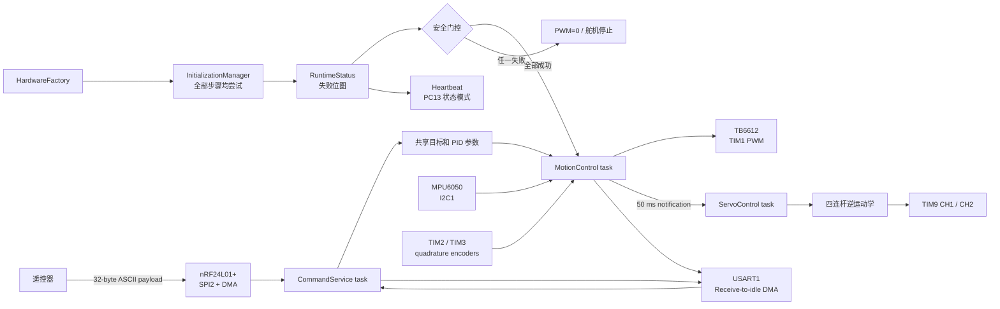
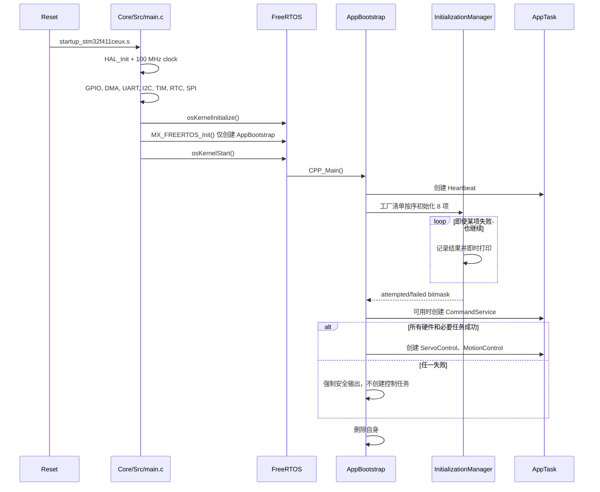

# 小车端软件架构

本文描述 `car_firmware` 当前实际运行的任务、数据流、控制环和并发约束。
硬件接线、构建与首次上电流程见项目根目录的 [README](../README.md)。

## 数据流



命令接收和控制计算仍通过原有 `volatile` 目标值连接，以保持控制逻辑和协议
行为。启动状态已独立收敛到 `RuntimeStatus`；扩展控制目标时仍需考虑多字段更新
的一致性。

## 启动流程



`CPP_Main()` 只在调度器运行后执行，因此舵机软件定时器、nRF DMA 信号量和会
阻塞等待 DMA 的初始化都处于合法 RTOS 上下文。`HardwareFactory` 负责板级
对象装配和初始化清单；`InitializationManager` 不做失败短路，最终报告再由
UserApp 决定任务依赖和安全策略。

### 初始化清单与故障聚合

`HardwareFactory::create_initialization_plan()` 返回固定容量数组，不使用虚基类、
RTTI 或动态分配。每个元素包含稳定 ID、名称、初始化函数和板级上下文。这是针对
单片机约束采用的工厂 + 命令/策略组合：应用层只遍历统一接口，具体 HAL 句柄仅
存在于 `BoardHardware.cpp`。

| bit | 模块 | 成功条件 |
| ---: | --- | --- |
| 0 | command-uart | USART1 receive-to-idle DMA 成功启动 |
| 1 | imu-mpu6050 | I2C 事务成功且 WHO_AM_I 为 `0x68` |
| 2 | left-encoder | TIM2 encoder interface 成功启动 |
| 3 | right-encoder | TIM3 encoder interface 成功启动 |
| 4 | wheel-motor | TIM1 两个 PWM channel 均成功启动 |
| 5 | left-servo | TIM9 CH1 与对应软件定时器可用 |
| 6 | right-servo | TIM9 CH2 与对应软件定时器可用 |
| 7 | radio-nrf24 | SPI 配置完成且 RF_CH/SETUP_AW 回读匹配 |

定时器步骤只能证明 MCU 外设可用，不能检测没有识别/反馈信号的板外电机、编码器
或舵机是否真实连接。MPU6050 和 nRF 有可验证身份/寄存器，因此主控板单独上电
时通常得到失败位图 `0x82`。

安全门控要求硬件报告全成功、Heartbeat/CommandService 创建成功，并且
ServoControl 创建成功后，才临时打开 `control_enabled` 并创建 MotionControl。
任何失败都会调用 `BoardHardware::force_safe_outputs()`。运行期间连续 3 次 IMU
读取失败也会原子式关闭控制许可、把状态改为 `runtime_fault` 并安全停机。

## 任务模型

FreeRTOS tick 为 1 kHz，`xTaskCreate()` 的栈深度单位是 32-bit word。

| 任务 | 优先级 | 栈 | 周期/唤醒源 | 主要职责 |
| --- | ---: | ---: | --- | --- |
| MotionControl | 29 | 2500 words | 10 ms | IMU、编码器、串级 PID、电机 PWM |
| CommandService | 28 | 2000 words | UART/nRF 通知；100 ms 超时 | 命令解析、无线 IRQ、遥测、状态应答 |
| ServoControl | 28 | 256 words | MotionControl 每 50 ms 通知 | 腿高限幅、逆运动学、舵机目标 |
| AppBootstrap | CMSIS low | 512 words | 仅启动阶段 | 硬件初始化、任务装配，随后删除自身 |
| Heartbeat | 1 | 192 words | 80..920 ms，按状态变化 | 独立驱动 PC13 状态心跳 |

`AppTask` 统一封装任务名称、栈、优先级、句柄和通知，使用固定字符串与启动期
动态任务分配，不使用 `std::string` 或运行期堆分配。

### MotionControl

实际创建的是 `MotionControlFunc_PID()`。每 10 ms：

1. 根据腿高重新计算俯仰静态偏置和姿态环 `Kp`；
2. 读取 MPU6050，经 VQF 得到 Roll、Pitch、Yaw；
3. 更新姿态 PID；
4. 组合直行和差速 PWM，限幅后写入 TB6612。

每累计 5 次，即每 50 ms：

1. 读取左右轮 RPM；
2. 速度 PID 根据平均 RPM 生成俯仰目标；
3. 差速 PID根据左右 RPM 差生成转向 PWM；
4. 横滚增量式 PID 和几何补偿生成左右腿高度差；
5. 通知 `ServoControl` 更新舵机。

控制关系可概括为：

```text
angle_target = velocity_pid(velocity_target, average_rpm)
differ_pwm   = differ_pid(differ_target, left_rpm - right_rpm)
even_pwm     = angle_pid(angle_target, pitch + angle_bias)

left_pwm  = clamp(even_pwm + differ_pwm, -1000, 1000)
right_pwm = clamp(even_pwm - differ_pwm, -1000, 1000)
```

横滚误差绝对值超过 3° 时，会叠加正弦几何补偿。左右腿目标随后被限制到
`44.5..78.5 mm`。

### ServoControl

任务阻塞等待直接任务通知，不主动轮询。收到通知后：

1. 限制左右目标腿高；
2. 通过 `LegKinematics::getMotorAngleForHeight()` 求舵机角；
3. 两侧都减去 10° 装配偏置；
4. 调用 `setAngle_Smooth(..., 1000)` 更新平滑目标。

`Servo` 使用 10 ms FreeRTOS 软件定时器逐步逼近目标。

### CommandService

`TaskReactor` 给每个信号分配一个任务通知 bit：

- UART receive-to-idle 完成后，将最多 32 字节放入命令队列；
- nRF IRQ 到来后读取状态；收到 payload 时将其放入同一个命令队列；
- TX 成功或达到最大重试次数后，将 nRF 切回 RX；
- 命令队列容量为 4；
- 100 ms 无事件超时时，若启用遥测则发送一帧 nRF 数据；
- `ping` 和 `status` 在安全模式下仍可应答；
- nRF 不可用时不绑定其 IRQ，也不会调用其收发接口。

命令名称区分大小写。解析器按空格分隔 token，不提供转义、校验和或身份认证。

## 当前默认控制参数

| 参数 | 默认值 | 说明 |
| --- | ---: | --- |
| Angle `Kp / Ki / Kd` | `70 / 0 / 60` | 姿态环；运行时 `Kp` 会随腿高重算 |
| Angle bias | `12.6°` | 运行时会随腿高重算 |
| Velocity `Kp / Ki / Kd` | `0.05 / 0.008 / 0` | 平均轮速到俯仰目标 |
| Difference `Kp / Ki / Kd` | `2 / 0.001 / 0` | 左右轮速差到差速 PWM |
| Roll `Kp / Ki` | `0 / -0.4` | 横滚到左右腿高度差 |
| Velocity target | `0` | RPM 目标 |
| Difference target | `0` | 左右 RPM 差目标 |
| Roll target | `0°` | 车体横滚目标 |
| Leg height | `44.5 mm` | 共同腿高目标 |
| Motor dead zone | `50 / 50` | TB6612 A/B PWM counts |

在线修改方式见 [命令参考](commands.md)。

## 中断与 DMA

| 中断 | NVIC 优先级 | ISR 到任务的同步 |
| --- | ---: | --- |
| SPI2 RX/TX DMA | 5 | binary semaphore |
| USART1 RX/TX DMA | 5 | RX 通知 / TX 固定缓冲队列 |
| SPI2 global | 5 | HAL SPI IRQ |
| USART1 global | 5 | HAL UART IRQ |
| nRF IRQ / EXTI15_10 | 6 | direct-to-task notification |
| TIM2 / TIM3 | 6 | HAL TIM IRQ |
| TIM5 HAL time base | 15 | HAL tick |

`configLIBRARY_MAX_SYSCALL_INTERRUPT_PRIORITY` 为 5。调用 FreeRTOS ISR API
的中断，NVIC 数值优先级不能小于 5。

MotionControl 的 `vTaskDelayUntil()` 已移到临界区之前，避免在禁止调度时阻塞。
原控制计算和采样仍整体位于临界区内，以保持既有共享状态语义；它会推迟相关
DMA/EXTI 中断，因此不要在其中增加格式化或额外慢速操作。后续若改变控制数据
模型，应先引入显式状态快照，再进一步缩小临界区，而不是直接删掉保护。

## 内存模型

- FreeRTOS heap 为 32 KiB，使用 `heap_4.c`；
- `BoardHardware` 是 `CPP_Main()` 内的静态对象，在调度器运行后构造并永久存活；
- AppTask 通过 `xTaskCreate()` 分配，但只在启动阶段创建；
- 舵机软件定时器和 nRF SPI 二值信号量同样在调度器启动后创建；
- 初始化清单、报告、任务配置和 BSP 设备对象均使用固定容量存储；
- UART 数据缓冲、ETL 队列和命令表使用固定容量；
- UART 默认有 10 个 128 字节 TX 缓冲和 10 个 128 字节 RX 缓冲；
- UART TX 缓冲耗尽时，新日志会被静默丢弃；
- 控制周期内不应新增 `new`、`malloc` 或无界 STL 容器。

## 模块边界

| 模块 | 当前职责 |
| --- | --- |
| `Application/InitializationManager` | 顺序执行、继续失败、聚合位图和观察回调 |
| `Application/AppTask` | 固定配置的 FreeRTOS 任务创建、句柄与通知封装 |
| `Application/RuntimeStatus` | 系统状态、安全许可和 ST-Link 可观测变量 |
| `Bsp/BoardHardware` | HAL 句柄/引脚绑定、设备所有权和统一安全输出 |
| `Bsp/HardwareFactory` | 生成有序硬件初始化清单 |
| `MPU6050` / `vqf` | I2C 采样、量程换算、姿态融合 |
| `HallEncoder` | 定时器正交编码、累计计数、RPM 换算 |
| `TB6612` | PWM、方向和死区 |
| `Servo` | 物理角度到脉宽、软件定时器平滑 |
| `LegKinematics` | 四连杆正/逆运动学 |
| `PID` | 位置式和增量式 PID |
| `NRF24L01P` | SPI 寄存器、收发状态机、IRQ 处理 |
| `LkUart` | Receive-to-idle DMA 和异步格式化发送 |
| `TaskReactor` | 通知 bit 到回调的分发、命令 token 解析 |
| `Component/UserApp/main.cpp` | 任务装配、共享状态和当前业务流程 |

`LQR` 是保留的实验控制器；当前构建会编译它，但 `CPP_Main()` 不创建
`MotionControlFunc()`。`MainControl.*` 目前为空壳，不在运行路径中。

## 已知实现约束

以下是阅读代码或调参时必须知道的当前行为：

- `Angle_kp` 和 `Angle_bias` 每 10 ms 根据腿高重算，在线写入只会短暂生效；
- 当前平均腿高表达式实际为 `(Left_Legheight + Left_Legheight) / 2`，没有读取
  右腿高度；若依赖左右腿平均值，应先修正并重新标定；
- `rollpid -p` 和 `rollpid -i` 当前都写入 `Adapt_y_ki`；
- `motor` 命令仅在控制许可有效且 MotionControl 存活时发送任务通知；PID 路径
  仍不消费该通知，因此它不会覆盖闭环 PWM；
- 电机、编码器和舵机没有器件身份反馈，初始化成功只证明对应 MCU 定时器成功；
- nRF 遥测命令会临时把车端从 RX 切到 TX，发送完成或失败后才恢复 RX；
- 控制参数只保存在 RAM 中，复位后恢复编译时默认值。
