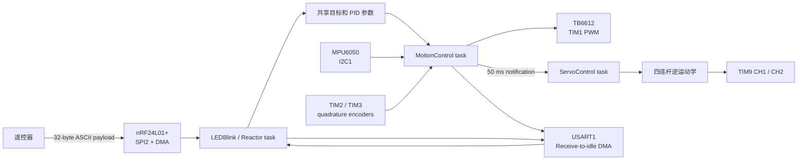
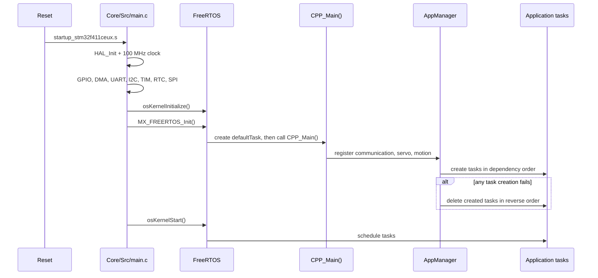

# 小车端软件架构

本文描述 `car_firmware` 当前实际运行的任务、数据流、控制环和并发约束。
硬件接线、构建与首次上电流程见项目根目录的 [README](../README.md)。

## 数据流



命令接收和控制计算通过 `AppModules` 内部的 `ControlState` 连接。字段保持
`volatile` 以兼容原有访问方式，但遥控四字段、腿高左右值和动作位都在短临界区
内整帧提交/快照；`volatile` 本身不承担互斥作用。

## 启动流程



`CPP_Main()` 在调度器启动前创建任务。默认 CMSIS-RTOS2 任务只等待 1 s 后
删除自身，不参与控制。`CPPMain: success` 表示三个模块均完成注册且三个任务的
`xTaskCreate()` 全部返回 `pdPASS`；失败时管理器按反序回滚已创建任务。

## 任务模型

FreeRTOS tick 为 1 kHz，`xTaskCreate()` 的栈深度单位是 32-bit word。

| 任务 | 优先级 | 栈 | 周期/唤醒源 | 主要职责 |
| --- | ---: | ---: | --- | --- |
| MotionControl | 29 | 2500 words | 10 ms | IMU、编码器、串级 PID、电机 PWM |
| LEDBlink | 28 | 2000 words | UART/nRF 通知；100 ms 超时 | 命令解析、无线 IRQ、遥测、PC13 |
| ServoControl | 28 | 256 words | 正常每 50 ms、跳跃每 10 ms 通知 | 腿高限幅、逆运动学、舵机目标与软件确认 |
| defaultTask | CMSIS low | 64 words | 启动后等待 1 s | 删除自身 |

`LEDBlink` 的名称来自早期实验。它现在是 UART/nRF 事件反应器；PC13 根据绝对
tick 输出状态图案，不再无条件翻转。

默认构建将 `WL1_REQUIRE_UPRIGHT_STARTUP` 设为 `OFF`。MPU6050 完成稳定重力采样
并给出可信姿态后，姿态环只需一个可信样本就会在任意俯仰/横滚角启用；I2C 读取
失败、陀螺仪饱和、控制任务超时和电机 PWM 限幅仍然有效。设为 `ON` 时恢复原有的
20 样本启动观察，并要求俯仰误差不超过 8°、横滚不超过 10°、角速度不超过
40°/s 且轮速不超过 5 rpm。

### MotionControl

实际运行的是 `AppModules` 中的 PID 控制任务。每 10 ms：

1. 原子读取控制目标，检查 250 ms 遥控失联保护；
2. 按实际 tick 间隔读取左右编码器，给恢复/跳跃安全门提供最新轮速；
3. 推进 400 ms 控制档位插值和原始调参斜坡，并根据左右腿平均高度计算俯仰偏置和 `Kp`；
4. 从 MPU6050 一次 burst 读取 accel/gyro，经模长、饱和及预测重力方向门控后更新 VQF；
5. 更新 IMU 监督的跳跃状态机（默认 dry-run）；
6. 更新姿态 PID，组合直行和差速 PWM，按档位权限限幅后写入 TB6612。

MPU6050 初始化失败时，控制任务把两个电机 PWM 保持为 0，并以 1 s 周期让出 CPU；
不会在缺少姿态反馈时继续运行平衡控制，串口/无线诊断任务仍可调度。
运行中单次无效样本不会被当作新姿态使用；连续三次失败或陀螺原始饱和会把
两个轮电机 PWM 置零，恢复后重置/预置 PID 历史。
控制任务用实际 tick 间隔推进编码器、档位、腿速率、跳跃阶段和 PWM 斜率；PID
积分/微分也按实际间隔相对 10 ms/50 ms 名义周期归一化，避免调度抖动改变增益。
若一次间隔超过 30 ms，会停止电机、重置融合并禁止 `vTaskDelayUntil` 连续追赶
旧周期；tick 未前进的追赶轮次会直接跳过。

每累计 5 次，即每 50 ms：

1. 对最近 5 个 10 ms RPM 样本求平均；
2. 速度 PID 根据平均 RPM 生成俯仰目标；
3. 差速 PID根据左右 RPM 差生成转向 PWM；
4. 横滚增量式 PID 和几何补偿生成左右腿高度差；
5. 通知 `ServoControl` 更新舵机。

控制关系可概括为：

```text
angle_target = velocity_pid(velocity_target, average_rpm)
differ_pwm   = differ_pid(differ_target, left_rpm - right_rpm)
even_pwm     = angle_pid(angle_target, pitch + angle_bias)

left_pwm  = clamp(even_pwm + differ_pwm, -1000, 1000)
right_pwm = clamp(even_pwm - differ_pwm, -1000, 1000)
```

横滚误差绝对值超过 3° 时，会叠加正弦几何补偿。左右腿目标随后被限制到
`44.5..78.5 mm`。

### ServoControl

任务阻塞等待直接任务通知，不主动轮询。收到通知后：

1. 限制左右目标腿高；
2. 通过 `LegKinematics::getMotorAngleForHeight()` 求舵机角；
3. 两侧都减去 10° 装配偏置；
4. 调用 `setAngle_Smooth(..., 1000)` 更新平滑目标；
5. 发布 ready、目标消费序号、软件平滑完成标志和任务心跳。

`Servo` 使用 10 ms FreeRTOS 软件定时器逐步逼近目标。
这些字段只确认软件执行链；由于舵机没有位置传感器，不能证明输出轴实际到位。

### LEDBlink / Reactor

`TaskReactor` 给每个信号分配一个任务通知 bit：

- UART receive-to-idle 完成后，将最多 32 字节放入命令队列；
- nRF IRQ 到来后读取状态；收到 payload 时将其放入同一个命令队列；
- 先绑定 Reactor 再启动 RX；若 IRQ 已经为低，主动执行服务；
- 初始化/SPI 失败退出 ready，并每 1 s 重试；100 ms 周期还会补轮询低电平 IRQ；
- TX 成功或达到最大重试次数后，将 nRF 切回 RX；
- 命令队列容量为 4；
- 100 ms 超时时按 IMU、nRF、跳跃和遥控新鲜度写入 PC13 状态图案；启用遥测时
  同时发送一帧 nRF 数据。

命令名称区分大小写。解析器按空格分隔 token，不提供转义、校验和或身份认证。

## 当前默认控制参数

| 参数 | 默认值 | 说明 |
| --- | ---: | --- |
| Angle `Kp / Ki / Kd` | `70 / 0 / 60` | 姿态环；运行时 `Kp` 会随腿高重算 |
| Angle bias | `12.6°` | 运行时会随腿高重算 |
| Velocity `Kp / Ki / Kd` | `0.05 / 0.008 / 0` | 平均轮速到俯仰目标 |
| Difference `Kp / Ki / Kd` | `2 / 0.001 / 0` | 左右轮速差到差速 PWM |
| Roll `Kp / Ki` | `0 / -0.4` | 横滚到左右腿高度差 |
| Velocity target | `0` | RPM 目标 |
| Difference target | `0` | 左右 RPM 差目标 |
| Roll target | `0°` | 车体横滚目标 |
| Leg height | `44.5 mm` | 共同腿高目标 |
| Motor dead zone | `50 / 50` | TB6612 A/B PWM counts |

在线修改方式见 [命令参考](commands.md)。

## 中断与 DMA

| 中断 | NVIC 优先级 | ISR 到任务的同步 |
| --- | ---: | --- |
| SPI2 RX/TX DMA | 5 | binary semaphore |
| USART1 RX/TX DMA | 5 | RX 通知 / TX 固定缓冲队列 |
| SPI2 global | 5 | HAL SPI IRQ |
| USART1 global | 5 | HAL UART IRQ |
| nRF IRQ / EXTI15_10 | 6 | direct-to-task notification |
| TIM2 / TIM3 | 6 | HAL TIM IRQ |
| TIM5 HAL time base | 15 | HAL tick |

`configLIBRARY_MAX_SYSCALL_INTERRUPT_PRIORITY` 为 5。调用 FreeRTOS ISR API
的中断，NVIC 数值优先级不能小于 5。

周期等待、I2C 读取、格式化和 PWM 更新均不在 FreeRTOS 临界区中。尤其禁止把
`vTaskDelayUntil()` 或其他阻塞 API 放进临界区，否则 tick/PendSV 无法调度，
控制任务可能锁死系统。多字段共享状态若需要一致快照，应只在短临界区内复制。

## 内存模型

- FreeRTOS heap 为 32 KiB，使用 `heap_4.c`；
- 应用任务通过 `xTaskCreate()` 动态创建，但只在启动阶段分配；
- nRF SPI 同步信号量使用静态存储创建；
- UART 数据缓冲、ETL 队列和命令表使用固定容量；
- UART 默认有 10 个 128 字节 TX 缓冲和 10 个 128 字节 RX 缓冲；
- UART TX 缓冲耗尽时，新日志会被静默丢弃；
- 控制周期内不应新增 `new`、`malloc` 或无界 STL 容器。

## 模块边界

| 模块 | 当前职责 |
| --- | --- |
| `MPU6050` / `vqf` | I2C 采样、量程换算、姿态融合 |
| `HallEncoder` | 定时器正交编码、累计计数、RPM 换算 |
| `TB6612` | PWM、方向和死区 |
| `Servo` | 物理角度到脉宽、软件定时器平滑 |
| `LegKinematics` | 四连杆正/逆运动学 |
| `PID` | 位置式和增量式 PID |
| `ControlProfile` | 三档完整控制参数和 400 ms 无跳变插值 |
| `JumpController` | 无 HAL 依赖、默认 dry-run 的 IMU 监督跳跃状态机 |
| `NRF24L01P` | SPI 寄存器、收发状态机、IRQ 处理 |
| `LkUart` | Receive-to-idle DMA 和异步格式化发送 |
| `TaskReactor` | 通知 bit 到回调的分发、命令 token 解析 |
| `Component/App` | 固定容量模块注册、生命周期、失败回滚 |
| `Component/AppModules` | 通信、舵机、运动控制任务和私有运行状态 |
| `Component/UserApp/main.cpp` | 只负责注册和启动应用模块 |

`LQR` 是保留的实验控制器；当前构建会编译它，但应用模块不启动该路径。
`MainControl.*` 目前为空壳，不在运行路径中。

## 已知实现约束

以下是阅读代码或调参时必须知道的当前行为：

- `Angle_kp` 和 `Angle_bias` 默认按左右腿平均高度自动计算；在线手动值持续有效，
  使用 `anglepid auto` / `anglebias auto` 才恢复自动模式；
- 强度档位主要改变速度、差速、横滚外环和目标权限，普通/柔和档保留完整的
  平衡内环 PWM 权限；
- 跳跃状态机会持续计算诊断轨迹，但默认编译开关关闭实际腿高覆盖；
- 跳跃 Ready 会等待控制档位和原始参数渐变全部完成；动作及 Fault 中冻结原始参数；
- `rollpid -p` 与 `rollpid -i` 分别写入横滚 `Kp` 和 `Ki`；
- `motor` 命令会发送任务通知，但 PID 控制路径没有消费该通知；
- TB6612 的零速度命令保持 compare 为 0；只有非零且低于死区的命令才提升到
  50 counts；
- nRF 遥测命令会临时把车端从 RX 切到 TX，发送完成或失败后才恢复 RX；
- 控制参数只保存在 RAM 中，复位后恢复编译时默认值。
