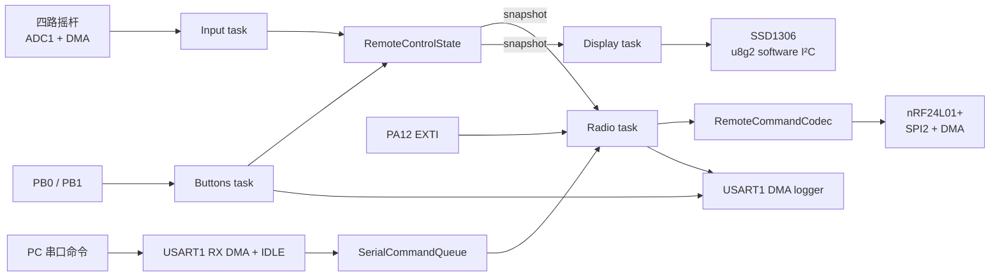

# 遥控器软件架构

本文描述 `tele_firmware` 的运行边界、并发模型和修改时需要保持的约束。
硬件接线、构建和基本操作见项目根目录的 [README](../README.md)。

## 数据流

`RemoteControlState` 是唯一的跨任务控制状态。写入和快照读取由 FreeRTOS
临界区保护，任务之间不共享可变字符串、DMA 缓冲区或外设事务。

## 任务模型

FreeRTOS tick 为 1 kHz，任务栈单位是 32-bit word。

| 任务 | 优先级 | 栈 | 周期/唤醒源 | 主要职责 |
| --- | ---: | ---: | --- | --- |
| Radio | idle + 4 | 1024 words | UART/nRF 通知，最长 5 ms 等待 | 串口解析、编码、发送、IRQ 处理、故障恢复 |
| Input | idle + 3 | 256 words | 50 ms / ADC DMA | 启动 ADC、等待采样、标定并更新状态 |
| Buttons | idle + 2 | 256 words | 5 ms | GPIO 采样、去抖和按键动作 |
| Display | idle + 1 | 512 words | 100 ms | 获取快照并刷新 OLED |

优先级体现数据链路的重要性：无线事件最先处理，其次是控制输入；按键和显示
允许更大的调度延迟。新增任务前应确认其优先级不会长期阻塞 Radio 或 Input。

### Radio

1. 上电等待 100 ms；
2. 初始化 nRF，失败时每 1 s 重试；
3. 等待 UART/nRF 通知，最长 5 ms 检查一次串口空闲和无线截止时间；
4. 在任务内读取 `STATUS`，反馈 `TX_DS`/`MAX_RT`，读取 RX FIFO 并转发串口；
5. 优先提交排队的串口命令；自动模式下每 50 ms 编码摇杆快照发送；
6. SPI 错误时退出当前循环，延时后重新初始化。

`MAX_RT` 会清空 TX FIFO 并切回接收模式。初始化失败只打印第 1 次和每第 5
次；摇杆无 ACK 只打印第 1 次和每第 100 次。串口发送的 ACK/失败逐条反馈，
摇杆发送成功也逐帧反馈。发送成功必须由 `TX_DS` 确认，SPI 完成不代表收到 ACK。

始终只允许一帧处于等待 TX 结果的状态，避免串口命令和摇杆共用硬件 FIFO 时
覆盖结果或改变收发模式。30 ms 内没有 TX 结果时再次轮询状态；仍未完成则报错
并重新初始化。RX FIFO 每轮最多读取三帧，读完 payload 后才清除 `RX_DR`。

串口接收使用 128 字节 normal-mode DMA，关闭 HT 通知，IDLE/TC 回调将数据
复制到八槽固定队列后立即重启 DMA，并通知 Radio。解析完全在任务内完成：
CR/LF 或连续空闲 50 ms 结束命令，`nrfsend` 去掉前缀后最多 32 字节。
`SerialCommandQueue` 保存八条命令，支持 DMA 分段与一包多行。超长命令整体
拒绝，队列满会报出丢弃计数。RX 错误后的重启不释放仍被 TX DMA 使用的日志缓冲。
串口命令每 50 ms 最多处理一条，无线帧也至少间隔 50 ms，保证突发命令的发送
结果能通过固定容量 UART 日志队列输出。

`joystick off/on` 只改变 Radio 的自动发包开关。Input、Buttons、Display 继续
运行；串口 payload 直接使用小车协议，不写入摇杆状态。

### Input

ADC1 按 Rank 1..4 依次采集 Roll、Leg、Turn、Speed。任务启动一次
DMA normal-mode 转换，并等待最多 5 ms 的任务通知。只有 DMA 完成且
`HAL_ADC_GetError()` 为 0 时才更新控制状态。

ADC 失败时停止 DMA 并保留上一份有效控制状态。错误日志同样经过频率限制。

### Buttons

每 5 ms 同时读取一次 GPIOB 输入寄存器：

- 状态连续稳定 4 个样本后才确认变化，等效去抖时间约 20 ms；
- 松开时生成 `clicked`；
- 稳定按下满 1 s 生成一次 `long_pressed`；
- 已生成长按后，松开不再生成短按。

### Display

显示任务只消费 `RemoteControlSnapshot`，不直接读取 ADC 或按键。OLED
初始化失败时 `render()` 安静返回，因此显示故障不会阻塞无线控制。

## 状态和锁定语义

`RemoteControlState` 同时保存：

- Speed、Turn 的最新限幅值；
- Leg、Roll 的实时摇杆值；
- Leg、Roll 实际发出的命令值；
- 两个锁定标志。

未锁定时，命令值跟随实时值。按下锁定键时捕获最新实时值；解锁时命令立即
跳到摇杆当前值。Speed 和 Turn 始终实时更新。

所有对外字段必须通过 `snapshot()` 一次性读取，避免同一帧混合两个采样周期。

## 中断与 DMA

| 中断 | 优先级 | ISR 到任务的同步 |
| --- | ---: | --- |
| SPI2 RX/TX DMA | 5 | 静态 binary semaphore |
| SPI2 error | 5 | 释放 SPI 等待者并由任务检查错误码 |
| ADC1 DMA | 5 | direct-to-task notification |
| USART1 TX DMA | 5 | 释放日志缓冲并启动下一帧 |
| USART1 IDLE / RX DMA | 5 | 复制接收数据、重启 DMA、通知 Radio |
| nRF IRQ / EXTI15_10 | 6 | direct-to-task notification |

`configLIBRARY_MAX_SYSCALL_INTERRUPT_PRIORITY` 为 5。调用 FreeRTOS ISR API
的中断不能设置成数值小于 5 的更高硬件优先级。

## 固定内存策略

- nRF SPI 信号量使用 `xSemaphoreCreateBinaryStatic()`；
- UART 日志器使用 4 个固定 128 字节缓冲；
- UART RX 使用 128 字节 DMA 缓冲和八槽接收队列；串口命令使用八槽固定队列；
- 无线 payload 使用固定 `std::array<uint8_t, 32>`；
- 各任务栈在启动时一次性从 FreeRTOS heap 分配；
- 周期运行期间不使用 `new`、`malloc` 或动态 STL 容器。

UART 日志缓冲全部占用时，新日志会被丢弃而不是阻塞控制任务。可通过
`LkUart::droppedMessages()` 检查累计丢弃数量。

## 模块边界

| 模块 | 可依赖内容 | 不应承担的职责 |
| --- | --- | --- |
| `Joystick` | 标定常量和纯数值转换 | ADC、任务、全局状态 |
| `Button` | 当前电平和 tick | GPIO、回调框架、任务通知 |
| `RemoteControlState` | FreeRTOS 临界区 | 协议文本、显示、外设 |
| `RemoteCommandCodec` | 状态快照 | nRF/SPI、任务调度 |
| `SerialCommandQueue` | 字节流和空闲边界 | HAL、ISR、无线发送 |
| `NRF24L01P` | HAL GPIO/SPI、FreeRTOS semaphore | 控制协议和 UI |
| `RemoteDisplay` | 状态 DTO、u8g2 | ADC、按键和无线状态机 |
| `LkUart` | ETL format、HAL UART DMA、任务通知 | 命令解析、控制流程和阻塞重试 |

新增功能应优先延续这些边界，而不是把解析、硬件和业务逻辑重新集中到
`main.cpp`。

## CubeMX 重新生成检查项

重新生成 `WL1_F411CEU6_Tele.ioc` 后至少检查：

1. `Core/Src/freertos.c` 的 USER CODE 中仍调用 `CPP_Main()`；
2. ADC Rank 和 DMA normal mode 未改变；
3. SPI2、ADC、USART DMA 中断优先级仍为 5；
4. PA12 EXTI 优先级仍为 6、触发沿仍为 falling；
5. PA15/PA10 的 USART1 复用未变化，USER CODE 中的 PA9 TX 镜像仍保留；
6. PB8/PB9 保持开漏输出，供软件 I²C 使用；
7. 顶层 CMake 的显式应用源文件列表仍完整；
8. Debug 和 Release 都能无项目代码警告地完成链接。
